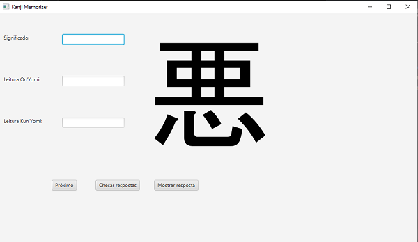

<h1>漢字　Kanji Memorizer　漢字</h1>

<h2>Software to memorize kanji readings</h2>

The aim of this project is to learn some coding and GIT. The project itself consists of a software 
capable of receiving kanjis and their meaning/readings. After having some kanjis in the database, present
it to the user in the form of questions.

<h3>Example: </h3>

This is how the program presents the kanji to the user. You can see the
correct answers, try answering or go to the next one.

<h3>How it works: </h3>

The program needs a kanji database text file. The format should be exactly like that:

<blockhead>
1 : {
Character : 悪
Meaning : Evil, bad, demon
OnReading : アク
KunReading : わる
}</blockhead>

Where the first number will be the Kanji ID. The following lines should be always
separated with a space, a colon and another space. The } marks the ending of the kanji
and the start of the next one.
